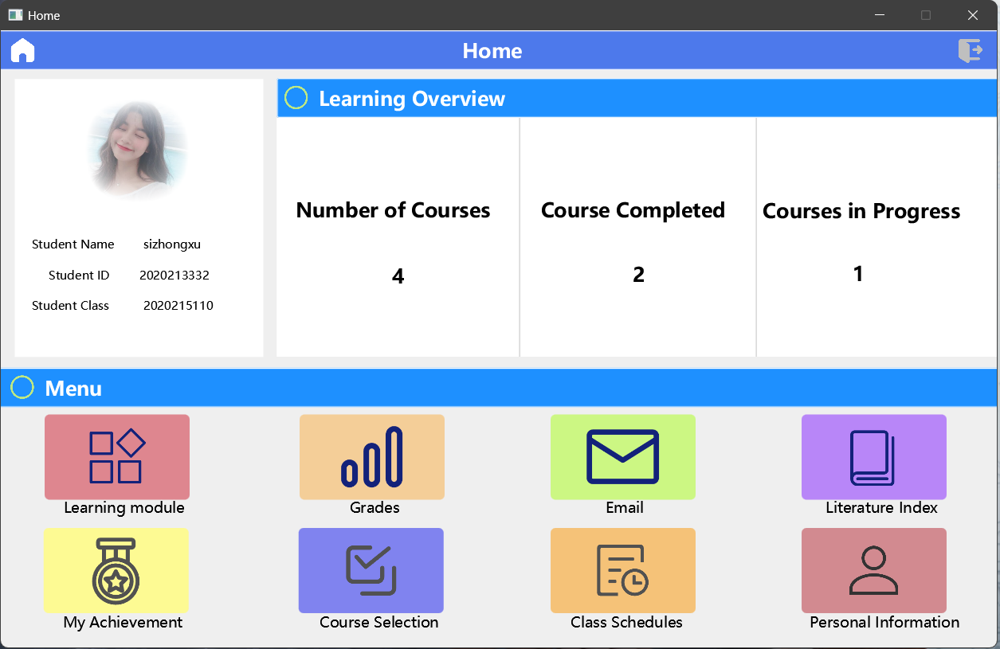
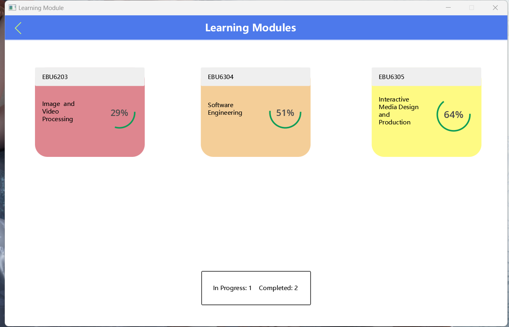
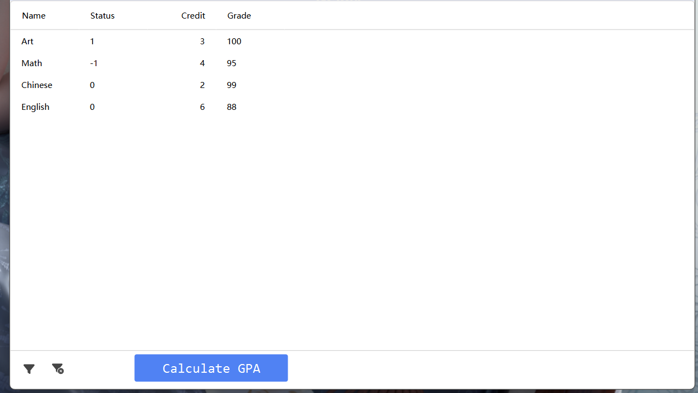
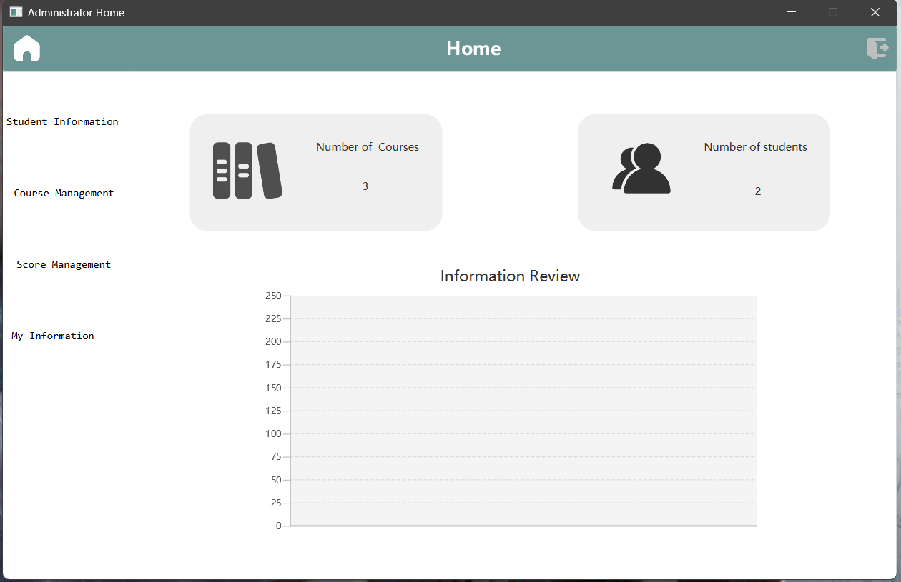
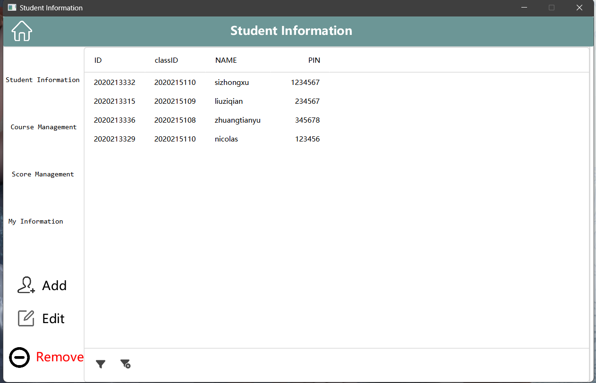
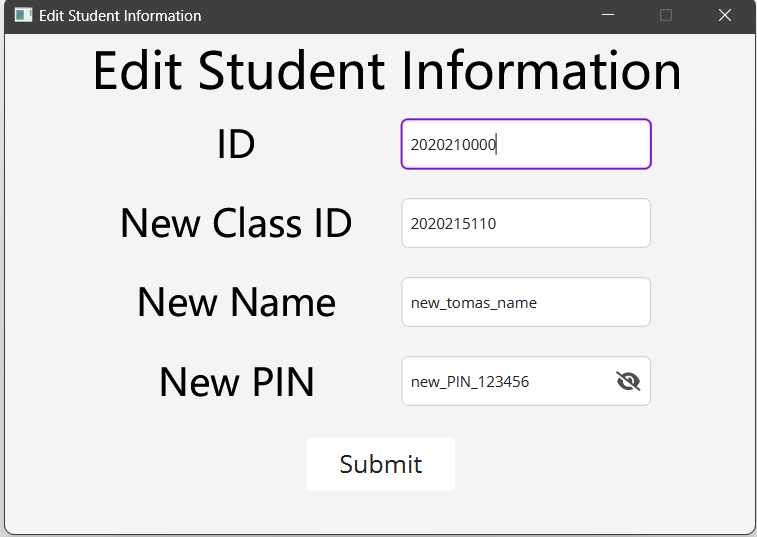

# SoftwareEngineeringG47
软件工程大作业库

## Introduction
This is the Group Project of Group 47 for the EBU6304 – Software Engineering Course. This is a teaching system that can realize student login, view learning status, view grades, administrator login, and add, delete, change and look up students.

这是软件工程（EBU6304）G47组的项目，一个可以实现学生登录，查看学习状况，查看成绩，管理员登录，增删改查学生的教务系统。

## Environment
The project is based on the Maven/javafx implementation, it is recommended to use the IDEA loading environment and use, its version is as follows:

项目基于Maven/javafx 实现，建议使用IDEA加载环境和运行代码，版本如下：

**JDK version：OpenJDK-20**

**javafx-maven-plugin： 0.0.8**

**junit : 4.13.2**

The detailed version can be found in the pom .xml

## Operation Guidelines

No need to configure third-party libraries, it can run smoothly on Windows/Mac, please consult Usermamual for more help for detailed operation procedures 

无需配置第三方库，其可以在Windows/Mac上流畅运行，详细操作流程请查询User manual 获取更多帮助

If the project reports an error such as "Module-javafx not found", please close the project, directly delete the .idea folder in the project file, and then open the project with IDEA and rebuild it with Maven.

如果项目报告诸如"Module-javafx not found"之类的错误，请关闭项目，直接删除工程文件中的.idea文件夹之后再用IDEA打开项目用Maven重新构建即可。

## Screenshots

### Login screen:

 
### Student Interface:
 

 

 

### Administrator Interface:
 
 
 
 
 
 
 
